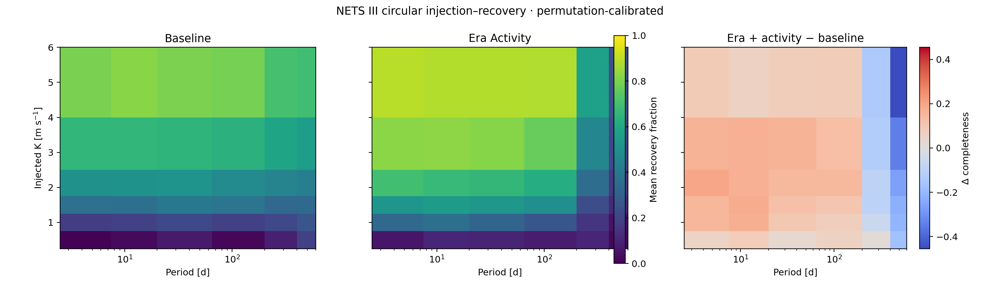
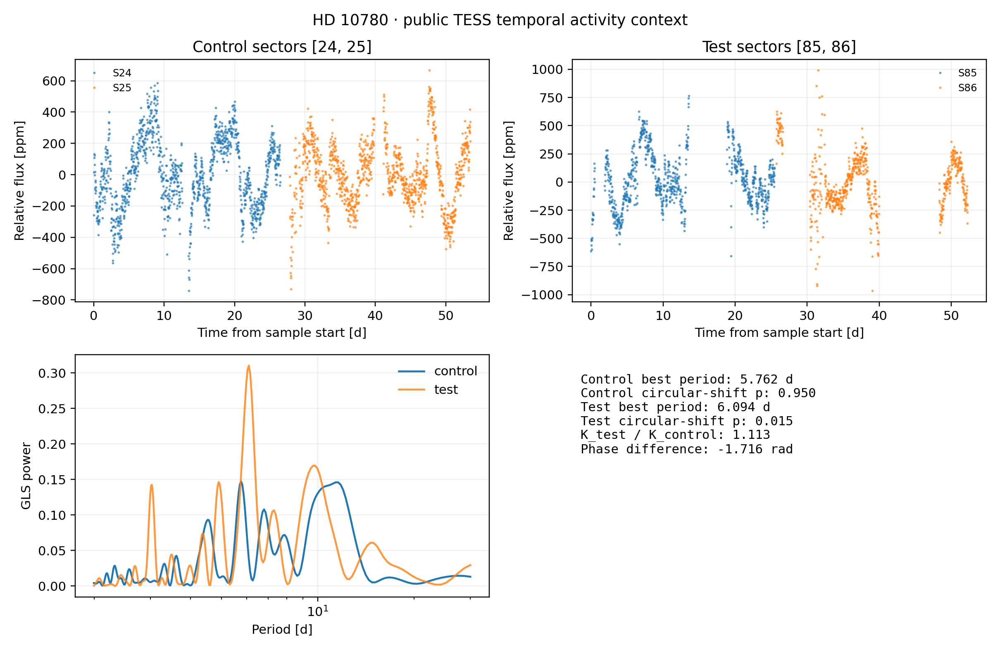
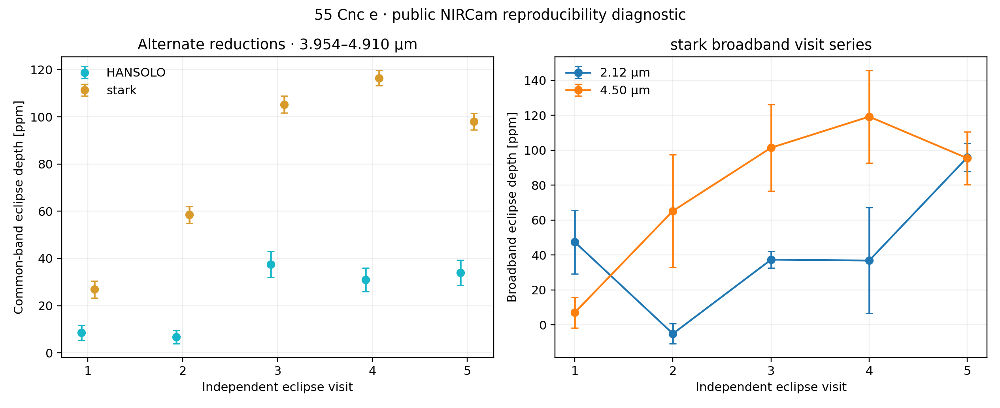

# Open Exoplanet Evidence Lab

[](https://github.com/Biswajit1999/open-exoplanet-discovery-lab/actions/workflows/tests.yml)
[](https://github.com/Biswajit1999/open-exoplanet-discovery-lab/actions/workflows/science-validation.yml)
[](https://github.com/Biswajit1999/open-exoplanet-discovery-lab/actions/workflows/web-build.yml)

**Biswajit Jana · public-data research release 0.3.1 · 24 September 2026**

[Research interface](https://biswajit1999.github.io/open-exoplanet-discovery-lab/) · [validated result record](research/RESULTS_2026-09-23.md) · [data-release registry](research/DATA_RELEASE_REGISTRY.md)

## Abstract

The Open Exoplanet Evidence Lab tests whether exoplanet inferences remain stable when instrument eras, stellar activity, cadence, wavelength and reduction provenance are modelled explicitly. This release completes four public-data studies—a NETS III extreme-precision radial-velocity completeness experiment, an ESO NIRPS × HARPS archive census, a temporally calibrated TESS activity comparison and a 55 Cnc e atmospheric-reduction reproducibility analysis—and freezes a Gaia DR3 identity layer for the NETS sample. It makes **no new-planet claim**.

The central result is methodological but quantitative: a nuisance model can improve short-period recovery while suppressing long-period sensitivity. Across 40 NETS III stars, adding run and activity terms changes mean completeness by only +0.0205, yet individual population-grid cells differ by as much as 0.4542. At 500 d, the richer model removes substantial injected signal power. A model that lowers residual scatter is therefore not automatically a better detection model.

## Validated results

### NETS III: completeness depends on the nuisance model

The public NETS III tables contain 5,920 RV rows for 41 survey stars. Forty stars have at least 20 complete RV, uncertainty, run and S-index rows, supplying 5,782 measurements to the injection/recovery experiment.

Three declared models were tested on a grid of six periods (5–500 d), six semi-amplitudes (0.5–5 m s⁻¹), six phases and 100 deterministic residual permutations per target and model:

1. one global offset;
2. run offsets plus per-run white jitter;
3. run offsets, per-run jitter and a linear S-index term.



| Period | Baseline K50 | Run-offset K50 | Run + activity K50 |
|---:|---:|---:|---:|
| 5 d | 2.00 m s⁻¹ | 1.57 m s⁻¹ | 1.43 m s⁻¹ |
| 10 d | 1.98 m s⁻¹ | 1.58 m s⁻¹ | 1.36 m s⁻¹ |
| 30 d | 1.93 m s⁻¹ | 1.56 m s⁻¹ | 1.43 m s⁻¹ |
| 100 d | 2.15 m s⁻¹ | 1.77 m s⁻¹ | 1.52 m s⁻¹ |
| 300 d | 2.38 m s⁻¹ | 4.04 m s⁻¹ | 3.80 m s⁻¹ |
| 500 d | 2.58 m s⁻¹ | not reached | not reached |

K90 is deliberately not reported as a number: the tested amplitude grid does not bracket 90% population recovery. Leave-one-run-out projection retains a median 98.6% of a 5 d signal, 95.3% at 100 d, 88.4% at 300 d and 89.2% at 500 d; the worst-phase median falls to 69.6% at 500 d.

The descriptive sample has a median 92 epochs per target, 1,001.95 d baseline, 0.34 m s⁻¹ quoted internal uncertainty and a 13.05% median change between raw and run-demeaned weighted RMS. Run de-meaning is not treated as harmless cleaning because it can absorb astrophysical power.

Machine-readable outputs: [`results/nets3_completeness_2026-09-23/`](results/nets3_completeness_2026-09-23/)

### Gaia DR3: canonical identity without a companion claim

Exact SIMBAD identifier resolution maps all 41 NETS III survey stars to 41 distinct Gaia DR3 source IDs. The frozen table carries the SIMBAD canonical name and coordinate source alongside Gaia epoch-2016 positions, parallaxes, proper motions, photometric context and RUWE. The uploaded target list, SIMBAD query, Gaia ADQL, source-table checksum and output checksums are retained.

These fields provide identity and public astrometric context only. In particular, RUWE is not interpreted as a companion detection statistic, and no Gaia DR4 product is assumed.

Machine-readable outputs: [`results/gaia_dr3_identity_2026-09-24/`](results/gaia_dr3_identity_2026-09-24/)

### ESO NIRPS × HARPS: a large overlap, not yet a chromatic-RV result

A complete live ESO TAP run returned 34,751 public NIRPS products, matching an independent count query. Those products group into 852 **archive target identities**. Coordinate queries found public HARPS products for 696 identities, including 662 with at least one NIRPS/HARPS epoch pair within one hour and 664 within one day. All 852 target queries completed with zero errors.

These counts describe archive products and labels, not a deduplicated stellar catalogue or homogeneous RV time series. A precision optical/NIR comparison still requires FITS-level product inspection, duplicate handling, and DRS/PROCSOFT verification. NIRPS products from the documented DRS 3.2.6 affected interval must not be used for precision-RV science unless corrected reprocessing is verified. No chromatic semi-amplitude conclusion is made in this release.

Machine-readable outputs: [`results/eso_nirps_harps_2026-09-23/`](results/eso_nirps_harps_2026-09-23/)

### TESS: analytic significance does not survive the correlated null

Public SPOC 120 s light curves for HD 10780 were split into control sectors 24–25 and later test sectors 85–86. With `QUALITY == 0`, finite positive uncertainties, a 7-MAD clip and 30-minute weighted bins, the strongest generalized Lomb–Scargle periods are 5.762 d and 6.094 d.



The analytic false-alarm probabilities are extremely small, but sector-preserving circular shifts give p = 0.950 for the control peak and p = 0.0149 for the test peak. The fixed-control-period phase difference is −1.716 rad and the fitted test/control amplitude ratio is 1.113. This is activity context only: it is neither a planet detection nor a secure stellar-rotation measurement.

Machine-readable outputs: [`results/tess_hd10780_2026-09-23/`](results/tess_hd10780_2026-09-23/)

### 55 Cnc e: the reduction pipeline is part of the measurement

The atmospheric metadata snapshot contains 1,826 spectrum records for 289 planets. The release analysis uses all 15 public Patel et al. (2024) NIRCam products for 55 Cnc e: five independent eclipse visits, two alternate reductions of each visit and five two-band products.



Across the common 3.95363–4.91020 μm interval, the median absolute HANSOLO–stark band-mean difference is 64.03 ppm. Descriptive random-effects fits require 14.11 ppm additional inter-visit scatter for HANSOLO and 37.14 ppm for stark; the stark broadband series require 35.30 ppm at 2.12 μm and 41.03 ppm at 4.50 μm.

The reductions share photons and the archive products do not publish a spectral covariance matrix. The comparison therefore bounds reduction and visit reproducibility; it does not establish atmospheric composition or assign an independent-pipeline significance.

Machine-readable outputs: [`results/atmosphere_55cnce_2026-09-23/`](results/atmosphere_55cnce_2026-09-23/)

### HD 190360: a retained model-adequacy warning

A deliberately restricted circular, NEID-only fit at the published 88.69 d period returns K = 0.702 ± 0.048 m s⁻¹ with 4.435 m s⁻¹ residual weighted RMS, compared with approximately 1.48 m s⁻¹ in the published multi-instrument context. The discrepancy is retained as evidence that the restricted model is inadequate, not presented as a revised planet amplitude.

## Evidence boundaries

- **Gaia DR4** remains gated. No result uses unreleased DR4 products or assumes a final archive schema.
- **SPORES-HWO II** remains gated until the consolidated public tables are accessible and verified.
- A recovered injected period is a sensitivity measurement, not a candidate classification.
- Alternate reductions of the same photons are not independent observations.
- Archive target identities are not automatically unique astrophysical objects.
- Synthetic validation values test the software and are never reported as astronomical measurements.

## Reproduce the release

Python 3.10–3.12 is supported. The website CI uses Node 22.

```bash
python -m venv .venv
source .venv/bin/activate        # Windows PowerShell: .venv\Scripts\Activate.ps1
python -m pip install --upgrade pip
python -m pip install -e ".[test,archives,tess]"
pytest -q
python scripts/run_validation_suite.py --output outputs/validation
```

Build the research interface:

```bash
PYTHONPATH=src python scripts/build_web_release_data.py
cd web
npm ci
npm run build
```

The public interface provides a target atlas, exact numeric completeness grids, model-difference and held-out-era views, literature claim gates, result-level provenance records, shareable view state and a print-safe paper mode. Its browser data contract is generated only from the frozen result directories; publication-critical calculations stay in Python.

The current suite contains 51 scientific/software tests. The deterministic validation recovers its declared synthetic 2.4 m s⁻¹, 23.7 d signal and 0.7 optical/NIR amplitude ratio. Those values validate numerical behaviour only.

Canonical analysis entry points are:

```text
scripts/build_public_snapshot.py
scripts/run_nets_completeness.py
scripts/build_eso_overlap_census.py
scripts/run_tess_temporal.py
scripts/run_atmosphere_reproducibility.py
scripts/build_gaia_identity_registry.py
scripts/build_web_release_data.py
```

Every result directory contains its configuration, provenance, checksums or query manifest, and machine-readable tables. Raw third-party archive payloads are not mirrored by default.

## Repository structure

```text
configs/     versioned source and analysis contracts
research/    hypotheses, release registry and validated report
scripts/     canonical acquisition and analysis entry points
src/exolab/  reusable scientific package
tests/       scientific invariants and software tests
results/     frozen machine-readable release outputs
web/         React/TypeScript research interface
```

## Data and software acknowledgements

This work uses public products and services from the NEID Earth Twin Survey, VizieR/CDS, SIMBAD, the Gaia Archive, the ESO Science Archive, MAST/TESS, the NASA Exoplanet Archive and the JWST/HST archive ecosystem. Consult [`research/DATA_RELEASE_REGISTRY.md`](research/DATA_RELEASE_REGISTRY.md) for release-specific source notes and access gates, and cite the original archives, data releases, software and scientific papers alongside this repository.

Software in this repository is MIT-licensed unless a file states otherwise. External archive data retain their original licences, access policies, acknowledgements and citation requirements.

## Author

**Biswajit Jana**

Independent open-science research project
